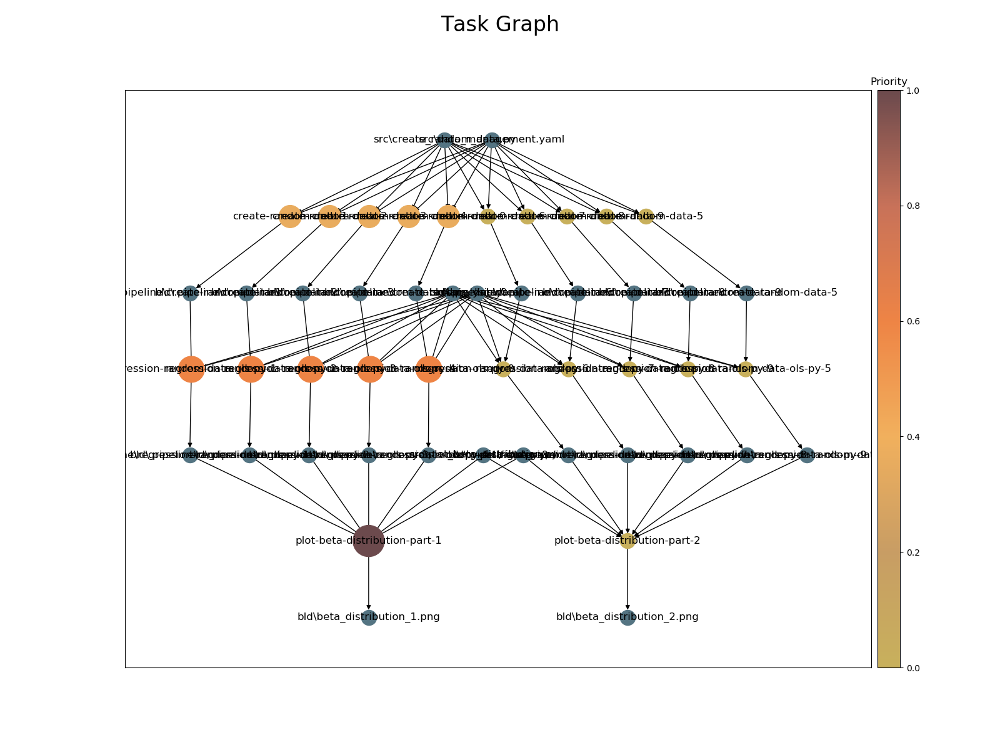

priority-scheduling
===================

This workflow does the following:

- Generate n random data sets.
- Fit a linear regression on each of the data sets.
- Plot the coefficients of the `x` variable for the first five and the last five
  regressions separately in a histogram.
- The first plot which requires the first five data sets and regressions has a higher
  priority than the rest of the tasks. The priority of the first plotting task trickles
  down to all its predecessors and their execution is preferred.

Task priorities are also displayed in the task graph.

